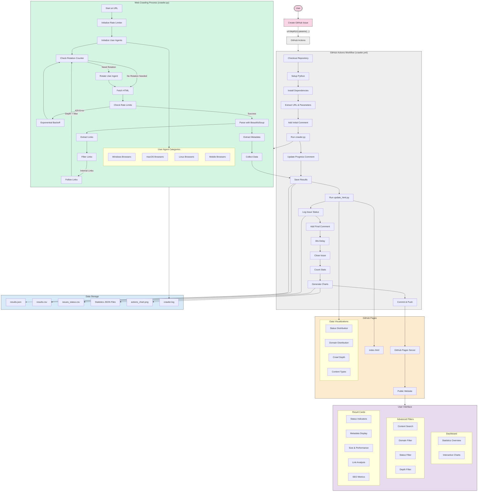

# PagesXcrawler Detailed Workflow Diagram

Below is a detailed Mermaid diagram showing how PagesXcrawler works, including user agent rotation:

```mermaid
flowchart TD
    %% Main components
    User([User]) --> CreateIssue[Create GitHub Issue]
    CreateIssue -->|"url:depth(n):params(...)"| GHActions[GitHub Actions]
    
    %% GitHub Actions Workflow
    subgraph GHWorkflow["GitHub Actions Workflow (crawler.yml)"]
        direction TB
        Checkout[Checkout Repository] --> SetupPython[Setup Python]
        SetupPython --> InstallDeps[Install Dependencies]
        InstallDeps --> ExtractParams[Extract URL & Parameters]
        ExtractParams --> AddComment1[Add Initial Comment]
        AddComment1 --> RunCrawler[Run crawler.py]
        RunCrawler --> UpdateProgress[Update Progress Comment]
        UpdateProgress --> SaveResults[Save Results]
        SaveResults --> UpdateHTML[Run update_html.py]
        UpdateHTML --> LogStatus[Log Issue Status]
        LogStatus --> AddComment2[Add Final Comment]
        AddComment2 --> Delay[30s Delay]
        Delay --> CloseIssue[Close Issue]
        CloseIssue --> CountStats[Count Stats]
        CountStats --> GenCharts[Generate Charts]
        GenCharts --> CommitPush[Commit & Push]
    end
    
    GHActions --> GHWorkflow
    
    %% Crawler Process
    subgraph CrawlerProcess["Web Crawling Process (crawler.py)"]
        direction TB
        StartCrawl[Start at URL] --> InitRate[Initialize Rate Limiter]
        InitRate --> InitAgents[Initialize User Agents]
        InitAgents --> CheckRotation[Check Rotation Counter]
        CheckRotation --> |"Need Rotation"| RotateAgent[Rotate User Agent]
        CheckRotation --> |"No Rotation Needed"| FetchHTML[Fetch HTML]
        RotateAgent --> FetchHTML
        FetchHTML --> CheckRate[Check Rate Limits]
        CheckRate -->|429 Error| BackOff[Exponential Backoff]
        BackOff --> CheckRotation
        CheckRate -->|Success| ParseHTML[Parse with BeautifulSoup]
        ParseHTML --> ExtractMeta[Extract Metadata]
        ParseHTML --> ExtractLinks[Extract Links]
        ExtractLinks --> FilterLinks[Filter Links]
        FilterLinks --> |Internal Links| FollowLinks[Follow Links]
        FollowLinks --> |Depth < Max| CheckRotation
        ExtractMeta --> CollectData[Collect Data]
        
        subgraph UserAgents["User Agent Categories"]
            direction TB
            Windows[Windows Browsers]
            MacOS[macOS Browsers]
            Linux[Linux Browsers]
            Mobile[Mobile Browsers]
        end
        
        InitAgents --> UserAgents
    end
    
    RunCrawler --> CrawlerProcess
    CollectData --> SaveResults
    
    %% Data Storage
    subgraph DataStorage["Data Storage"]
        direction TB
        ResultsJSON[results.json]
        ResultsCSV[results.csv]
        IssuesStatus[issues_status.csv]
        StatsJSON[Statistics JSON Files]
        ChartPNG[actions_chart.png]
        ErrorLog[crawler.log]
    end
    
    SaveResults --> ResultsJSON
    SaveResults --> ResultsCSV
    LogStatus --> IssuesStatus
    GenCharts --> StatsJSON
    GenCharts --> ChartPNG
    CrawlerProcess --> ErrorLog
    
    %% GitHub Pages
    subgraph GHPages["GitHub Pages"]
        direction TB
        IndexHTML[index.html]
        subgraph Visualizations["Data Visualizations"]
            StatusChart[Status Distribution]
            DomainChart[Domain Distribution]
            DepthChart[Crawl Depth]
            ContentChart[Content Types]
        end
        GHPagesServer[GitHub Pages Server]
        PublicSite[Public Website]
    end
    
    UpdateHTML --> IndexHTML
    UpdateHTML --> Visualizations
    CommitPush --> GHPagesServer
    GHPagesServer --> PublicSite
    
    %% User Interface
    subgraph UserInterface["User Interface"]
        direction TB
        subgraph Dashboard["Dashboard"]
            Overview[Statistics Overview]
            Charts[Interactive Charts]
        end
        subgraph Filters["Advanced Filters"]
            Search[Content Search]
            DomainFilter[Domain Filter]
            StatusFilter[Status Filter]
            DepthFilter[Depth Filter]
        end
        subgraph Results["Result Cards"]
            StatusBadge[Status Indicators]
            MetaInfo[Metadata Display]
            SizeStats[Size & Performance]
            LinkAnalysis[Link Analysis]
            SEOMetrics[SEO Metrics]
        end
    end
    
    PublicSite --> UserInterface
    
    %% Styling
    classDef user fill:#f9d5e5,stroke:#333,stroke-width:1px;
    classDef github fill:#eeeeee,stroke:#333,stroke-width:1px;
    classDef crawler fill:#d5f5e3,stroke:#333,stroke-width:1px;
    classDef data fill:#d6eaf8,stroke:#333,stroke-width:1px;
    classDef pages fill:#fdebd0,stroke:#333,stroke-width:1px;
    classDef ui fill:#e8daef,stroke:#333,stroke-width:1px;
    
    class User,CreateIssue user;
    class GHActions,GHWorkflow github;
    class CrawlerProcess crawler;
    class DataStorage data;
    class GHPages pages;
    class UserInterface ui;
```

[Rest of the documentation continues...]
