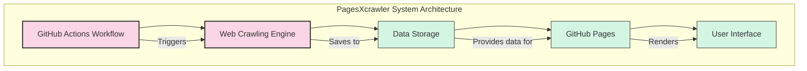
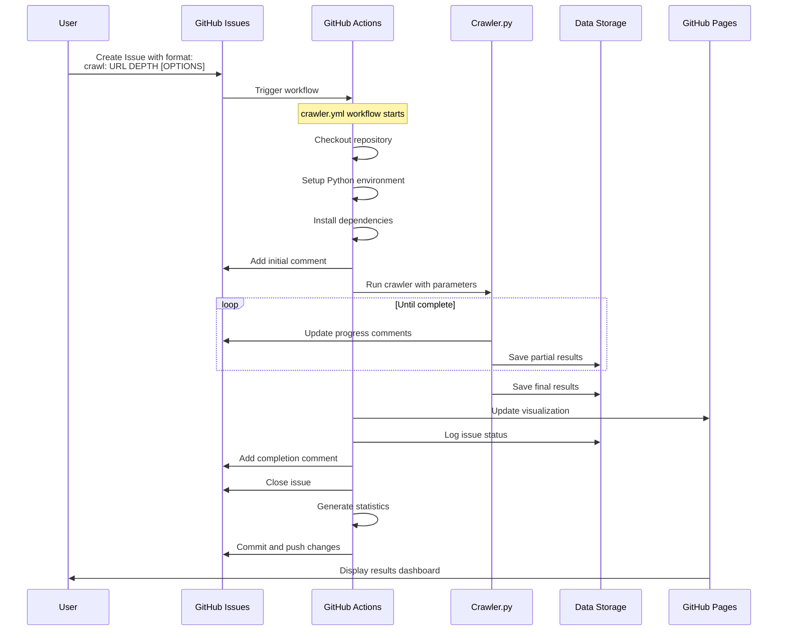
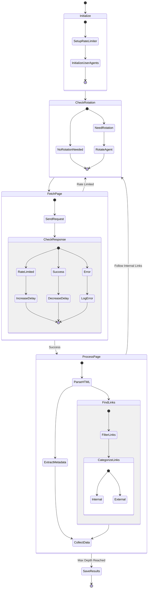
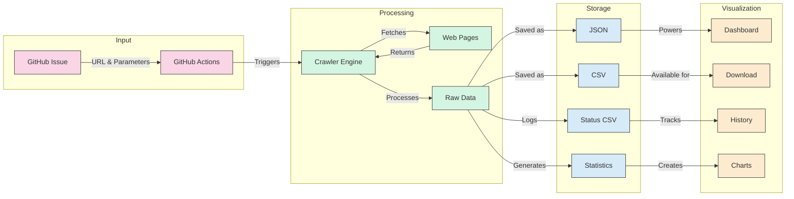
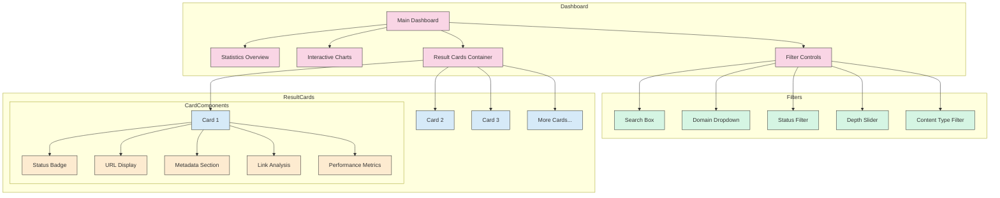
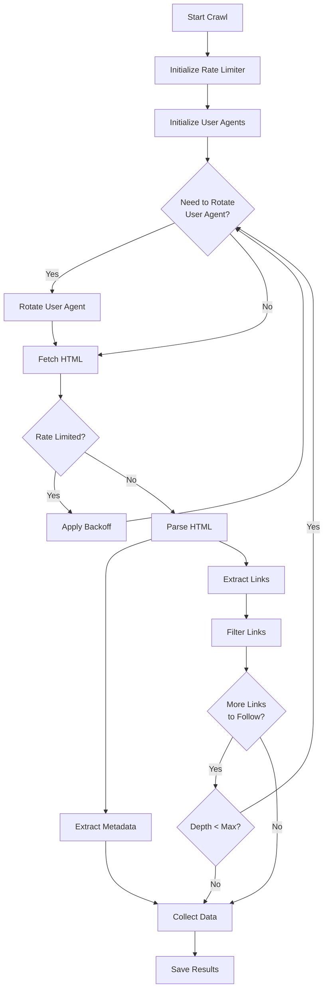
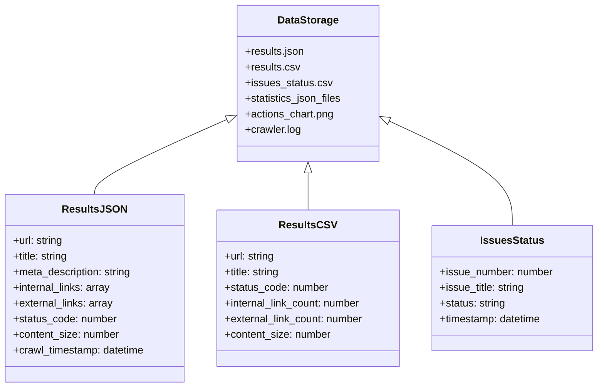
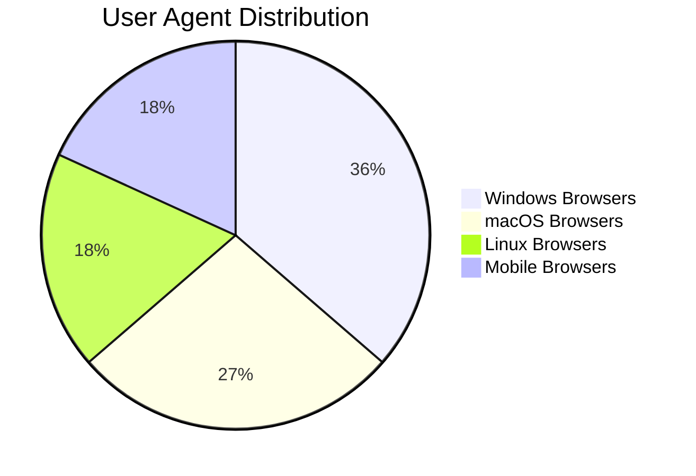
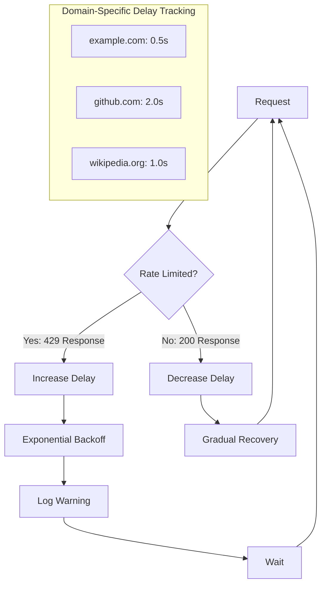
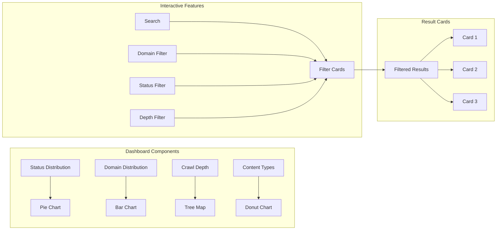

# PagesXcrawler: Detailed Workflow Guide

## Overview

PagesXcrawler is a powerful web crawling system that combines GitHub Actions automation with advanced web crawling capabilities. This document provides a comprehensive visual guide to how the system works, from issue creation to data visualization.

## Table of Contents

- [System Architecture](#system-architecture)
- [Workflow Diagrams](#workflow-diagrams)
  - [Complete System Overview](#complete-system-overview)
  - [GitHub Actions Workflow](#github-actions-workflow-diagram)
  - [Web Crawling Process](#web-crawling-process-diagram)
  - [Data Flow Diagram](#data-flow-diagram)
  - [User Interface Components](#user-interface-components)
- [Key Components](#key-components)
- [User Agent Rotation System](#user-agent-rotation-system)
- [Rate Limiting and Error Handling](#rate-limiting-and-error-handling)
- [Data Visualization](#data-visualization)

## System Architecture

PagesXcrawler consists of five main components that work together:



1. **GitHub Actions Workflow**: Triggered by issue creation, manages the entire process
2. **Web Crawling Engine**: Fetches and processes web pages with intelligent rate limiting
3. **Data Storage**: Saves results in multiple formats for analysis
4. **GitHub Pages**: Hosts the visualization dashboard
5. **User Interface**: Provides interactive access to crawled data

## Workflow Diagrams

### Complete System Overview

The following Mermaid diagram illustrates the complete workflow of PagesXcrawler:


### GitHub Actions Workflow Diagram

This diagram focuses specifically on the GitHub Actions workflow:



### Web Crawling Process Diagram

This diagram details the web crawling process and rate limiting:



### Data Flow Diagram

This diagram shows how data flows through the system:



### User Interface Components

This diagram illustrates the components of the user interface:



## Key Components

### GitHub Actions Workflow

The GitHub Actions workflow (`crawler.yml`) is triggered when a user creates an issue with the format `crawl: URL DEPTH [OPTIONS]`. The workflow:

1. **Checkout Repository**: Clones the repository to the GitHub Actions runner
2. **Setup Python**: Installs Python 3.8 on the runner
3. **Install Dependencies**: Installs required packages (requests, BeautifulSoup4)
4. **Extract Parameters**: Parses the issue title to extract URL, depth, and options
5. **Add Initial Comment**: Posts a comment with the configuration details
6. **Run Crawler**: Executes the crawler.py script with the extracted parameters
7. **Update Progress**: Posts progress updates as comments on the issue
8. **Save Results**: Stores the crawl results in JSON and CSV formats
9. **Update HTML**: Generates the visualization dashboard
10. **Log Status**: Records the issue status in issues_status.csv
11. **Add Final Comment**: Posts a completion comment with links to results
12. **Close Issue**: Automatically closes the issue when crawling is complete
13. **Generate Statistics**: Counts deployments and actions, generates charts
14. **Commit & Push**: Pushes all changes back to the repository

### Web Crawling Process

The crawler.py script implements an intelligent web crawler with:



Key features:
1. **Rate Limiting**: Prevents overloading websites with requests
2. **User Agent Rotation**: Cycles through different browser identities
3. **Exponential Backoff**: Automatically adjusts request rate when rate-limited
4. **Metadata Extraction**: Captures comprehensive page information
5. **Link Analysis**: Categorizes links as internal or external
6. **Depth Control**: Follows links up to the specified depth

### Data Storage

PagesXcrawler stores data in multiple formats:



| File | Description |
|------|-------------|
| results.json | Complete crawl results in JSON format |
| results.csv | Tabular data for spreadsheet analysis |
| issues_status.csv | Log of all crawl issues and their status |
| Statistics JSON | Badge data for GitHub README |
| actions_chart.png | Visualization of GitHub Actions statistics |
| crawler.log | Detailed log of the crawling process |

## User Agent Rotation System

PagesXcrawler implements a sophisticated user agent rotation system to avoid detection:



```
┌─────────────────────────────────────────────────────┐
│                 User Agent Categories                │
├───────────────┬───────────────┬───────────────┬─────┘
│ Windows        │ macOS          │ Linux          │ Mobile
├───────────────┼───────────────┼───────────────┼─────
│ Chrome         │ Safari         │ Chrome         │ Android
│ Firefox        │ Chrome         │ Firefox        │ iOS
│ Edge           │ Firefox        │               │
└───────────────┴───────────────┴───────────────┴─────
```

The system:
- Randomly shuffles user agents on initialization
- Rotates to a new agent after a configurable number of requests
- Logs each rotation for monitoring
- Covers major browsers and operating systems

## Rate Limiting and Error Handling

PagesXcrawler includes intelligent rate limiting:



1. **Domain-Specific Delays**: Tracks and adjusts delay times per domain
2. **429 Detection**: Automatically detects "Too Many Requests" responses
3. **Exponential Backoff**: Increases delay times when rate-limited
4. **Gradual Recovery**: Slowly reduces delays after successful requests

## Data Visualization

The visualization dashboard provides:



1. **Status Distribution**: Breakdown of HTTP status codes
2. **Domain Distribution**: Analysis of domains encountered
3. **Crawl Depth**: Visualization of page depth distribution
4. **Content Types**: Breakdown of content types
5. **Interactive Filtering**: Real-time filtering of results
6. **Searchable Cards**: Cards that can be searched and filtered

---

This detailed workflow guide provides a comprehensive overview of how PagesXcrawler works, from issue creation to data visualization. For more information, see the [Documentation](Documentation.md) or the [README](README.md).
