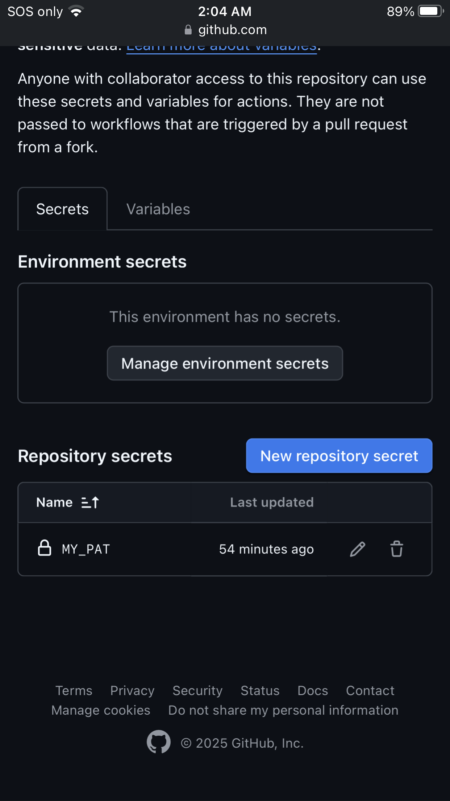
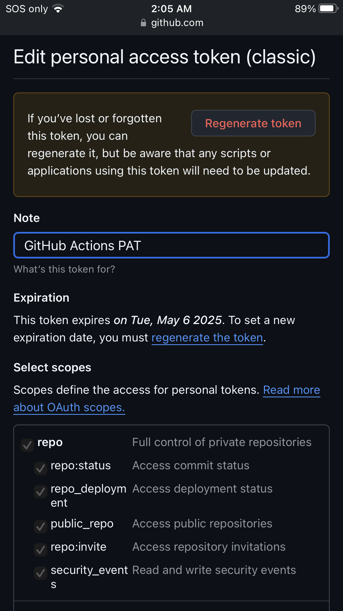

# 🅿🅰🅶🅴🆂🆇🅲🆁🅰🆆🅻🅴🆁
٩ʕ◕౪◕ʔو.url  ٩ʕ◕౪◕ʔو hmm.

- Web Crawler System -


<details>
  <summary>Actions and Deployments Chart</summary>
  
  
</details>

## Quick Links

<table align="center">
  <tr>
    <td align="center" style="border: 1px solid #007acc; padding: 10px; border-radius: 5px; background-color: #007acc;">
      <a href="Documentation.md" style="color: white; text-decoration: none; font-weight: bold;">Documentation - Quick explanation of the project</a>
    </td>
  </tr>
  <tr>
    <td align="center" style="border: 1px solid #007acc; padding: 10px; border-radius: 5px; background-color: #007acc;">
      <a href="https://theuselessweb.com" style="color: white; text-decoration: none; font-weight: bold;">Find a Site to Crawl - any site works</a>
    </td>
  </tr>
  <tr>
    <td align="center" style="border: 1px solid #007acc; padding: 10px; border-radius: 5px; background-color: #007acc;">
      <a href="https://github.com/unaveragetech/PagesXcrawler/issues/new" style="color: white; text-decoration: none; font-weight: bold;">Create a Crawl Issue</a>
    </td>
  </tr>
  <tr>
    <td align="center" style="border: 1px solid #007acc; padding: 10px; border-radius: 5px; background-color: #007acc;">
      <a href="https://github.com/unaveragetech/PagesXcrawler/deployments" style="color: white; text-decoration: none; font-weight: bold;">Check Deployment Jobs</a>
    </td>
  </tr>
  <tr>
    <td align="center" style="border: 1px solid #007acc; padding: 10px; border-radius: 5px; background-color: #007acc;">
      <a href="https://github.com/unaveragetech/PagesXcrawler/blob/main/data/results.csv" style="color: white; text-decoration: none; font-weight: bold;">View Last Run Results</a>
    </td>
  </tr>
  <tr>
    <td align="center" style="border: 1px solid #007acc; padding: 10px; border-radius: 5px; background-color: #007acc;">
      <a href="https://github.com/unaveragetech/PagesXcrawler/blob/main/data/issues_status.csv" style="color: white; text-decoration: none; font-weight: bold;">Access All Run History</a>
    </td>
  </tr>
  <tr>
    <td align="center" style="border: 1px solid #007acc; padding: 10px; border-radius: 5px; background-color: #007acc;">
      <a href="https://unaveragetech.github.io/PagesXcrawler/" style="color: white; text-decoration: none; font-weight: bold;">View Results Chart</a>
    </td>
  </tr>
</table>

## How It Works

PagesXcrawler is a versatile web crawler that can be used in two ways: through GitHub Issues or directly from the command line.

### 1. GitHub Issues Method

To start a crawl using GitHub Issues, create a new issue with the following format:

```
crawl: URL DEPTH [OPTIONS]
```

For example:
```
crawl: https://example.com 3
crawl: https://example.com 2 --max-pages 50 --timeout 15 --rotate-agent-after 5
```

- **URL**: The website you want to crawl
- **DEPTH**: The number of link levels to follow (1-5 recommended)
- **OPTIONS**: Additional parameters to customize the crawl

### 2. Command-Line Method

Run the crawler directly from the command line:

```bash
python crawler.py URL DEPTH [OPTIONS]
```

Examples:
```bash
# Basic crawl
python crawler.py "https://example.com" 2

# With parameters
python crawler.py "https://example.com" 2 --max-pages 50 --timeout 15 --rotate-agent-after 5
```

> **Note**: Always enclose the URL in quotes to prevent issues with special characters, especially in PowerShell.

## Command-Line Arguments Reference

| Argument | Required | Default | Description | Example |
|-----------|:--------:|:-------:|-------------|----------|
| **url** | ✅ | - | The URL to crawl (any domain) | `https://example.com` |
| **depth** | ✅ | - | Number of link levels to follow | `3` |
| **--max-pages** | ❌ | 100 | Maximum number of pages to crawl | `--max-pages 50` |
| **--timeout** | ❌ | 10 | Request timeout in seconds | `--timeout 15` |
| **--rotate-agent-after** | ❌ | 10 | Number of requests before rotating user agent | `--rotate-agent-after 5` |

## Crawling Process

After submitting your issue or running the command:

1. The crawler fetches the initial URL and extracts all links
2. It follows links up to the specified depth
3. Results are saved in both JSON and CSV formats in the `data` directory
4. The HTML visualization is updated with the latest results

### Results Storage

- **CSV Format**: Easily viewable on GitHub and compatible with spreadsheet applications
- **JSON Format**: Used to dynamically load results into the HTML visualization
- **HTML Visualization**: Interactive dashboard with searchable cards displaying URL information

To view the results, visit the [Results Dashboard](https://unaveragetech.github.io/PagesXcrawler/). If the page doesn't display the latest results, simply refresh it.

## Important Considerations

### Performance and Limitations

- **Crawling Depth**: Deeper depths may require longer processing times. Consider using the `--max-pages` parameter for large sites.
- **Rate Limiting**: The crawler respects website load by limiting requests per second. The rate limiting is handled automatically by the crawler.
- **User Agent Rotation**: More frequent rotation (`--rotate-agent-after`) may help avoid detection but could affect performance.
- **Timeout Settings**: Default timeout is 10 seconds per request. For slow sites, increase with the `--timeout` parameter.
- **Resource Usage**: A typical crawl with depth 3 and 100 pages takes approximately 2-3 minutes to complete.

```
Using the URL https://github.com/unaveragetech and a specified depth of 3, the web crawler performed its operations, which included crawling the website and executing the necessary deployment processes. The total time taken for this task was approximately 2 minutes.

Out of this total duration, the crawling process itself took around 1 minute and 27 seconds. The remaining time was utilized for deployment checks, ensuring that all relevant data was accurately processed and deployed.
```

## Setting Up for Private Use

If you want to use this system privately after forking the repository, follow these steps:

### 1. Fork the Repository

Click the "Fork" button in the upper right corner of the GitHub repository page.

### 2. Clone Your Fork

Clone your forked repository to your local machine:

```bash
git clone https://github.com/yourusername/PagesXcrawler.git
```

### 3. Configure GitHub Actions

Enable GitHub Actions in your private repository:

- Go to the "Settings" tab
- Under "Actions," select "General"
- Make sure actions are enabled

### 4. Set Up Secrets

For proper functionality, set up any required secrets (like Personal Access Tokens):

1. Navigate to `Settings` > `Secrets and variables` > `Actions`
2. Click **New repository secret** and add your secret named `MY_PAT`, ensuring it has read/write scopes



3. To get a token:
   - Click your profile > **Developer settings**
   - Create a token (classic), copy it, and name it `MY_PAT`



### 5. Update the `_config.yml`

Ensure the `_config.yml` file is configured to your repository settings and URLs. Although this file helps mitigate Jekyll issues, it can be left empty if not needed.

### 6. Test the System

Create a test issue in the format `crawl: URL DEPTH [OPTIONS]` to verify that everything works correctly. If successful, you'll see the bot's actions, and the issue will close. If there's an error (like 128, 104, or 404), it typically indicates permission issues with the token.

## Recent Enhancements

- **User Agent Rotation**: Configurable rotation of user agents to avoid detection
- **Enhanced Metadata Extraction**: Now captures favicon, canonical URL, social media tags, and more
- **Improved UI**: Modern, responsive dashboard with better styling and usability
- **Advanced Filtering**: Filter by domain, content type, and depth
- **Clickable Cards**: Navigate directly to crawled pages from the dashboard
- **Issue Comments**: Real-time progress updates during crawling
- **Command-Line Arguments**: Additional command-line arguments for fine-tuned control
- **Better Error Handling**: More robust error recovery and reporting

## Conclusion

The PagesXcrawler system offers an efficient solution for retrieving and visualizing web data with ease. If you have any questions, suggestions, or issues, don't hesitate to create a new issue in the repository!
