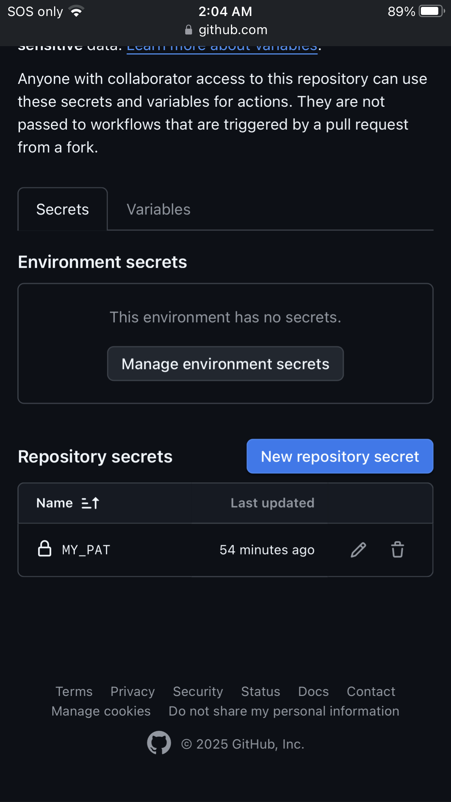

# 🕷️ PagesXcrawler

> A GitHub-powered web crawler: submit a URL via a GitHub Issue and get a live, interactive results dashboard hosted on GitHub Pages.


<details>
  <summary>Actions and Deployments Chart</summary>

  
</details>

---

## 🔗 Quick Links

<table align="center">
  <tr>
    <td align="center" style="border:1px solid #007acc;padding:10px;border-radius:5px;background:#007acc;">
      <a href="https://unaveragetech.github.io/PagesXcrawler/" style="color:white;text-decoration:none;font-weight:bold;">📊 Results Dashboard</a>
    </td>
    <td align="center" style="border:1px solid #007acc;padding:10px;border-radius:5px;background:#007acc;">
      <a href="https://unaveragetech.github.io/PagesXcrawler/past_crawls.html" style="color:white;text-decoration:none;font-weight:bold;">📜 Past Crawls &amp; How-To</a>
    </td>
  </tr>
  <tr>
    <td align="center" style="border:1px solid #007acc;padding:10px;border-radius:5px;background:#007acc;">
      <a href="https://github.com/unaveragetech/PagesXcrawler/issues/new" style="color:white;text-decoration:none;font-weight:bold;">🚀 Start a New Crawl</a>
    </td>
    <td align="center" style="border:1px solid #007acc;padding:10px;border-radius:5px;background:#007acc;">
      <a href="https://github.com/unaveragetech/PagesXcrawler/deployments" style="color:white;text-decoration:none;font-weight:bold;">🔍 Check Deployments</a>
    </td>
  </tr>
  <tr>
    <td align="center" style="border:1px solid #007acc;padding:10px;border-radius:5px;background:#007acc;">
      <a href="https://github.com/unaveragetech/PagesXcrawler/blob/main/data/results.csv" style="color:white;text-decoration:none;font-weight:bold;">📄 Last Run CSV</a>
    </td>
    <td align="center" style="border:1px solid #007acc;padding:10px;border-radius:5px;background:#007acc;">
      <a href="Documentation.md" style="color:white;text-decoration:none;font-weight:bold;">📚 Documentation</a>
    </td>
  </tr>
</table>

---

## 🧠 What Is PagesXcrawler?

PagesXcrawler is a zero-setup web crawling system built on top of **GitHub Actions** and **GitHub Pages**.

You submit a URL through a GitHub Issue (or the Actions UI), the crawler visits every reachable page up to the depth you specify, collects metrics for each page, and then publishes the results as an interactive HTML dashboard—automatically, every time.

### What the crawler collects per page

| Metric | Description |
|--------|-------------|
| **Title / Description** | Page `<title>` tag and `<meta name="description">` |
| **Word count** | Number of words in the visible text |
| **Image count** | Number of `` tags |
| **JS / CSS files** | Linked JavaScript and stylesheet files |
| **Internal links** | Links pointing to the same domain |
| **External links** | Links pointing to other domains |
| **Nofollow links** | Links with `rel="nofollow"` |
| **Font / Video / Audio** | Other embedded media resources |
| **URL length & depth** | Structural URL metrics |
| **HTTP status code** | Response code (200, 404, etc.) |
| **Crawl timestamp** | When the page was visited |

---

## 🚀 How To Use

### Method 1 — GitHub Issue (easiest)

1. Click **[New Issue](https://github.com/unaveragetech/PagesXcrawler/issues/new)**.
2. Set the **title** using this exact format:

```
crawl: URL DEPTH [OPTIONS]
```

**Examples:**

```
crawl: https://example.com 3
crawl: https://example.com 2 --max-pages 50 --timeout 15 --rotate-agent-after 5
```

3. Submit the issue. The bot will post a comment with the crawl configuration, run the crawl, and close the issue when done.
4. Visit the [Results Dashboard](https://unaveragetech.github.io/PagesXcrawler/) to see the output.

> **Tip:** Always enclose the URL in quotes when running locally (`python crawler.py "https://example.com" 2`), especially in PowerShell.

---

### Method 2 — Workflow Dispatch (via Actions UI)

1. Go to **[Actions → Web Crawler](https://github.com/unaveragetech/PagesXcrawler/actions/workflows/crawler.yml)**.
2. Click **Run workflow** and fill in the form fields.
3. The results are published automatically when the run completes.

---

### Method 3 — Command Line (local)

```bash
# Install dependencies
pip install -r requirements.txt

# Basic crawl
python crawler.py "https://example.com" 2

# Advanced crawl
python crawler.py "https://example.com" 3 --max-pages 50 --timeout 15 --rotate-agent-after 5
```

---

## ⚙️ Parameters Reference

| Parameter | Required | Default | Description |
|-----------|:--------:|:-------:|-------------|
| `url` | ✅ | — | Starting URL (must begin with `http://` or `https://`) |
| `depth` | ✅ | — | How many link-levels deep to crawl (1–5 recommended) |
| `--max-pages` | ❌ | 100 | Hard cap on total pages visited |
| `--timeout` | ❌ | 10 | Per-request timeout in seconds |
| `--requests-per-second` | ❌ | 2 | Initial rate limit |
| `--rotate-agent-after` | ❌ | 10 | Requests between user-agent rotations |

---

## 📁 Project Structure

```
PagesXcrawler/
├── crawler.py                   # Core crawler (rate limiting, metadata extraction, …)
├── index.html                   # Auto-generated results dashboard (GitHub Pages)
├── past_crawls.html             # Auto-generated past-crawls history + how-to guide
├── requirements.txt
├── data/
│   ├── results.json             # Full results from the latest crawl
│   ├── results.csv              # CSV version of latest results
│   ├── history/
│   │   └── crawl_history.csv   # Running log of every crawl
│   └── archive/                 # Time-stamped result snapshots
├── scripts/
│   ├── update_html.py           # Generates index.html from results
│   ├── generate_visualizations.py  # Creates charts + PDF report
│   └── generate_history.py      # Generates past_crawls.html
└── visualizations/
    ├── domains_chart.png
    ├── words_chart.png
    ├── links_chart.png
    └── report_<run_id>.pdf
```

---

## 🔄 How It All Works (step by step)

```
GitHub Issue / Workflow Dispatch
        │
        ▼
GitHub Actions (crawler.yml)
  1. Checkout repo
  2. python crawler.py <url> <depth> [options]
        └─► Visits each page, extracts metrics, saves data/results.json + .csv
  3. python scripts/generate_visualizations.py
        └─► Calls update_html.py → writes index.html
        └─► Generates PNG charts and a PDF report
        └─► Injects visualization charts into index.html
  4. python scripts/generate_history.py
        └─► Reads data/history/crawl_history.csv
        └─► Writes past_crawls.html (history table + how-to guide)
  5. git add + commit + push
        └─► GitHub Pages deploys index.html & past_crawls.html automatically
  6. Post summary comment on the issue (if triggered via issue)
```

---

## 🌐 Viewing Results

- **Live dashboard**: [https://unaveragetech.github.io/PagesXcrawler/](https://unaveragetech.github.io/PagesXcrawler/)
- **Past crawls & how-to**: [https://unaveragetech.github.io/PagesXcrawler/past_crawls.html](https://unaveragetech.github.io/PagesXcrawler/past_crawls.html)

The dashboard supports:
- 🔍 **Full-text search** across all crawled pages
- 🗂️ **Domain and depth filtering**
- 📊 **Interactive charts** (link distribution, content metrics)
- 📷 **Static visualizations** (domain bar chart, word-count histogram, avg links)
- 🟢 **HTTP status badges** on each page card (green = 2xx, yellow = 3xx, red = 4xx/5xx)
- 📖 **Click-to-expand** meta descriptions

---

## 🔒 Setting Up Your Own Fork

1. **Fork** this repository.
2. Enable **GitHub Actions** in your fork (`Settings → Actions → General`).
3. Enable **GitHub Pages** from the `main` branch root (`Settings → Pages`).
4. Add a repository secret named **`MY_PAT`** with a personal access token that has `repo` read/write scope:
   - `Settings → Secrets and variables → Actions → New repository secret`

   

5. Create a test issue: `crawl: https://example.com 2` – you should see the bot respond within minutes.

---

## ⚠️ Important Considerations

- **Depth vs. time**: depth 3 on a large site can take several minutes. Use `--max-pages` to keep runs short.
- **Rate limiting**: the crawler waits between requests and backs off automatically on HTTP 429.
- **Robots.txt**: the crawler does **not** currently check `robots.txt` – please crawl only sites you have permission to access.
- **Resource limits**: GitHub Actions free tier has 2,000 minutes/month. A typical depth-2 crawl uses ~1 minute.

---

## 📜 Recent Changes

- **Correct item counting**: fixed duplicate-loading bug that could double-count pages when both JSON and CSV data existed
- **Improved dashboard**: 6-metric summary cards, HTTP status badges on each result, JS/CSS counts per card, live filter count
- **Past Crawls page**: new `past_crawls.html` with searchable history table and embedded how-to guide
- **No-duplicate visualizations**: repeated runs no longer accumulate multiple chart sections in the HTML
- **Navigation**: header nav links between the dashboard and the history page
- **Updated README**: this document

---

## 💬 Questions or Issues?

Open a [GitHub Issue](https://github.com/unaveragetech/PagesXcrawler/issues/new) – the same channel you use to start a crawl!

